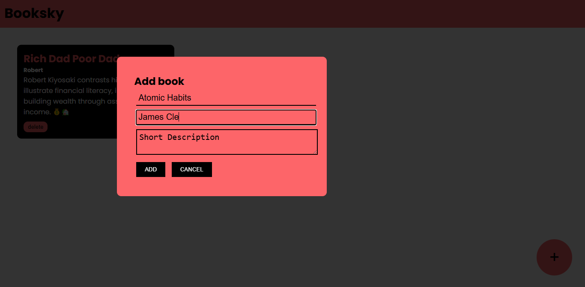

# 📚 Booksky Project

Booksky is a clean and responsive website built using HTML and CSS. It represents a landing page for a fictional online book store or library where users can explore book collections and more.

## 🔗 Live Demo

👉 [Click here to view Booksky](https://selvarajan-m.github.io/Booksky-project/)

## 📂 Project Repository

🔗 [GitHub Repository](https://github.com/Selvarajan-M/Booksky-project/)

## 🧰 Tech Stack

- **HTML5**
- **CSS3**
- **Git & GitHub** – for version control and hosting

## ✨ Features

- Beautiful and modern landing page design
- Fully responsive for all screen sizes
- Simple and clean layout with intuitive navigation

## 🚀 How to Run Locally

1. **Clone the repository**:
   ```bash
   git clone https://github.com/Selvarajan-M/Booksky-project.git
   ```

2. **Navigate to the folder**:
   ```bash
   cd Booksky-project
   ```

3. **Open `index.html` in your browser**

> ✅ No installations or additional setup needed.

## 📸 Screenshot



## 👨‍💻 Author

**Selvarajan M**  
GitHub: [@Selvarajan-M](https://github.com/Selvarajan-M)

---

⭐️ If you liked this project, consider starring the repository!
